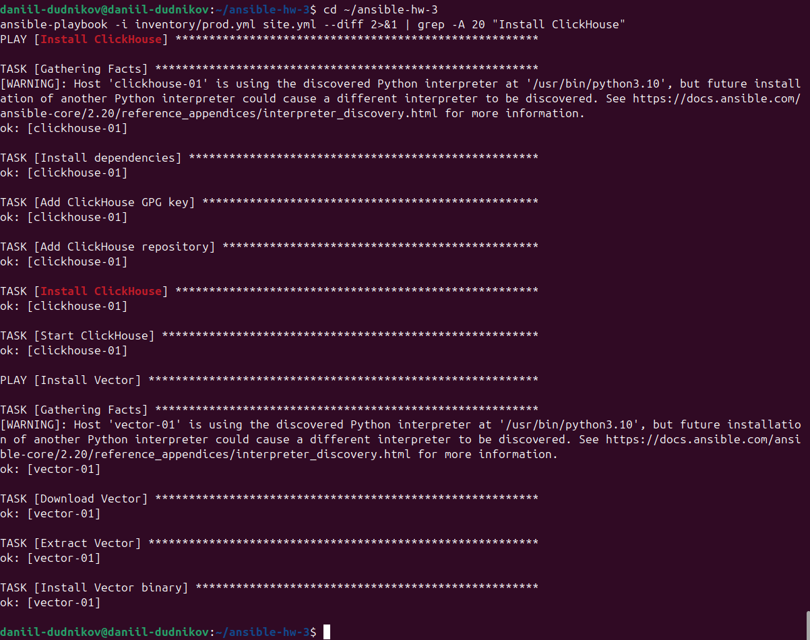
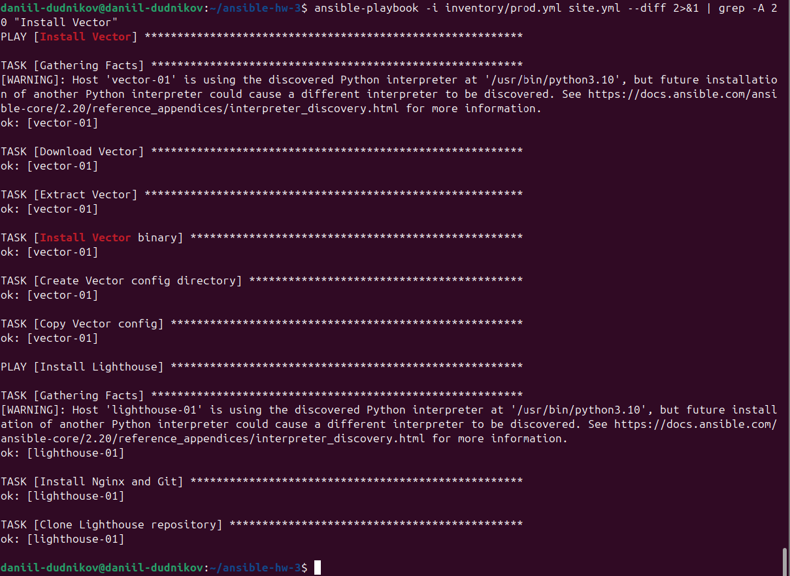
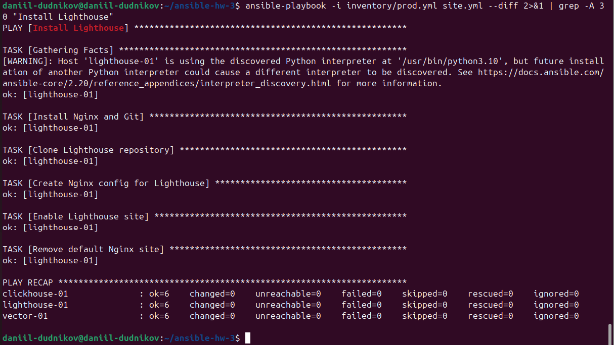
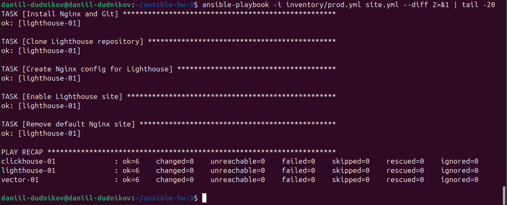
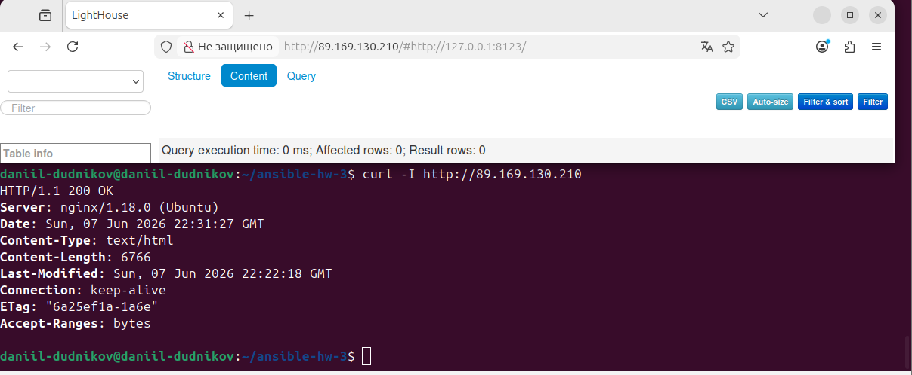
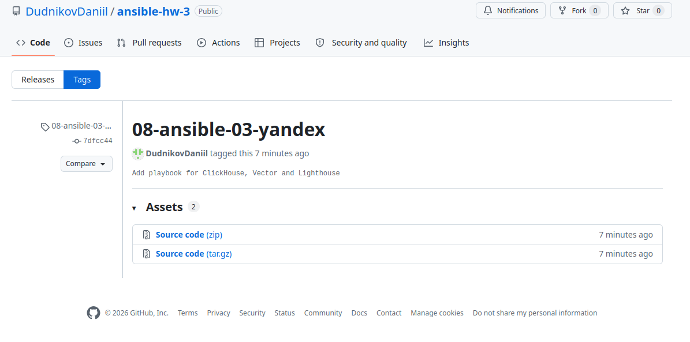

# Домашнее задание к занятию 3 «Использование Ansible»

**Выполнил:** DudnikovDaniil

---

## Описание

Playbook для автоматической установки и настройки трёх сервисов на хостах в Yandex Cloud:

| Сервис | Назначение | Порт |
|--------|------------|------|
| **ClickHouse** | Аналитическая СУБД | 8123 |
| **Vector** | Observability pipeline (агент сбора логов) | нет веб-интерфейса |
| **Lighthouse** | Веб-интерфейс для мониторинга | 80 |

---

## Структура проекта

```bash
ansible-hw-3/
├── .gitignore
├── inventory/
│   └── prod.yml              # Инвентарный файл с хостами
├── templates/
│   └── lighthouse.conf.j2    # Шаблон конфигурации Nginx
├── screenshots/              # Скриншоты выполнения
├── site.yml                  # Основной playbook
└── README.md
```

---

## Запуск playbook

```bash
ansible-playbook -i inventory/prod.yml site.yml --diff
```

---

## Результаты выполнения

### Установка ClickHouse

ClickHouse установлен и запущен на хосте `clickhouse-01`.

### Установка Vector

Vector установлен, настроен сбор демо-логов.

### Установка Lighthouse

Lighthouse установлен, Nginx настроен, сайт доступен по HTTP.

---

## Проверка идемпотентности

Повторный запуск playbook не вносит изменений:

```bash
ansible-playbook -i inventory/prod.yml site.yml --diff
```

Результат: `changed=0` для всех хостов.

---

## Скриншоты выполнения

### 1. Установка ClickHouse



### 2. Установка Vector



### 3. Установка Lighthouse



### 4. Идемпотентность (повторный запуск)



### 5. Проверка Lighthouse через curl

```bash
curl -I http://89.169.130.210
```



### 6. Тег на GitHub



---
